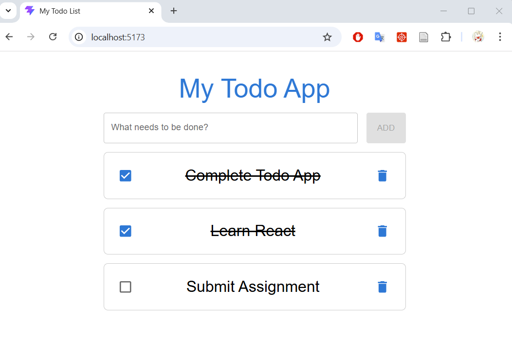

# Todo App

A Todo List application built with the **MERN Stack** (MongoDB, Express, React, Node.js).

## About the Project
### Tech Stack
- **Frontend**: Vite + TypeScript + React Compiler, Redux Toolkit, Material UI v7
- **Backend**: Express, Mongoose

### Features
- CRUD: View, add, edit, delete, mark tasks as complete/incomplete

### Origin
This project represents an **evolved version** of my earlier works, it consolidates the core features and technical patterns developed across my previous repositories into a single application:
1. Task Board (basic app without backend): [TUT888/TaskBoard](https://github.com/TUT888/TaskBoard)
2. Shopping Cart (shopping cart with state management using Redux Toolkit): [TUT888/ShoppingCart](https://github.com/TUT888/ShoppingCart)
3. Todo App with backend: [TUT888/my-todo-list](https://github.com/TUT888/my-todo-list)

## References
> To view all references during development process, please go to [REFERENCES.md](./REFERENCES.md)

- Backend:
  - NodeJS: [W3School - Node.js](https://www.w3schools.com/nodejs/)
  - ExpressJS: [W3School - Express.js](https://www.w3schools.com/nodejs/nodejs_express.asp)
  - MongoDB: [W3School - MongoDB.js](https://www.w3schools.com/mongodb/)
- Material UI v7: [MUI - The React component libary you always wanted](https://v7.mui.com/material-ui/getting-started/)